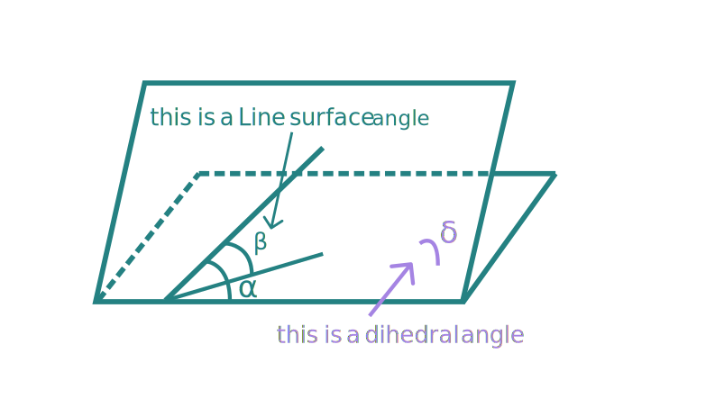
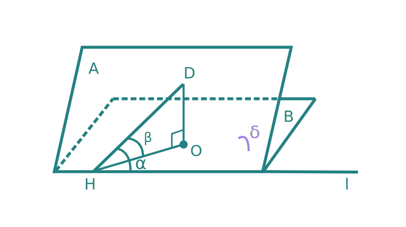
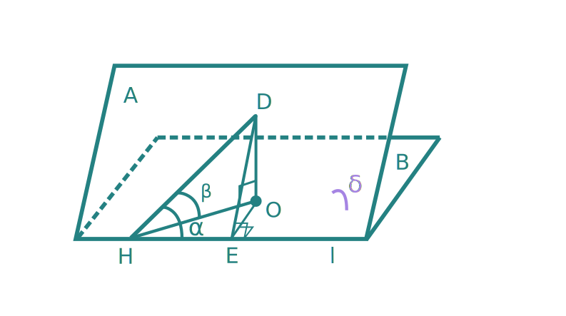

# The Angle Calculation Method-2

# 立体几何算角法-2

---

## 引入

[算角法-1](anglecalculate-1.md)只解决了简单的二面角与线线角之间的关系，没有涉及到线面角，所以有必要寻找其他公式对问题进行补充：

$$
\sin\alpha\cdot\sin\delta=\sin\beta
$$

---

## 理论推演

类似的，我们进行标记以及添加辅助线：

- 过点D作DO垂直于面B，垂足为O
- 记∠α，∠β，∠δ。
- 记线l

然后我们再作垂线：

$$
\sin\alpha=\frac{DE}{DH}
$$

$$
\sin\beta=\frac{DO}{DH}
$$

$$
\sin\delta=\frac{DO}{DE}
$$

则显然有如下：

$$
\sin\alpha\cdot\sin\delta=\sin\beta
$$

---

## 反思

是否任意情况适用呢？如果是钝角还适用吗？

$ans$: yes!!

推导过程相同，可自行尝试。

