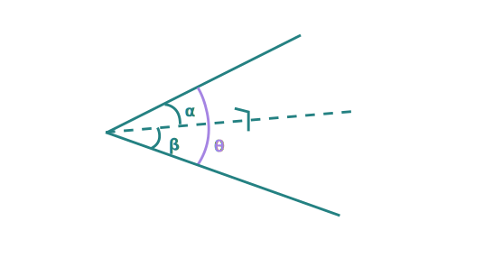
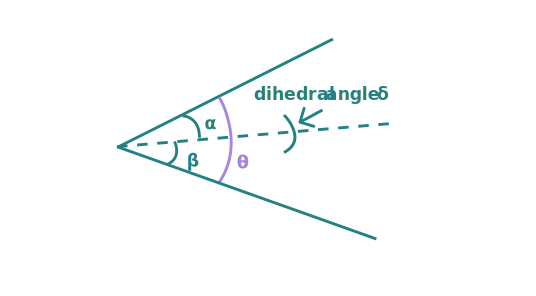
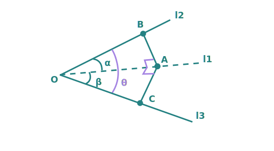

# The Angle Calculation Method-1
# 立体几何算角法-1

***

## 引入：
我们都知道在立体几何里面存在一个三余弦公式来对这一特殊情况进行计算：

$$
\cos\theta = \cos\alpha\cdot\cos\beta
$$

运算的前提是α所在面与β所在面所成的角为直角，这不禁引起我们的思考：是否有一个对非直角的解决方案？

***

## 理论推演

对类似的图型我们对其进行一些标记：

- ∠α,
  ∠β,
  ∠θ.
- 二面角δ
- α与β所在面交线 l1
- α与θ所在面交线 l2
- β与θ所在面交线 l3

然后我们取 l1 上一点A，并从A引出垂线AB，AC。满足B在 l2 上，C在 l3 上，A均为垂足。

此时由二面角的定义可知∠BAC即为二面角δ，于是我们可以进行计算：

$$
define:l=OA
$$
然后联立以下方程：
$$
\frac{(l\cdot\sec\alpha)^2+(l\cdot\sec\beta)^2-BC^2}{2\cdot l^2\cdot\sec\alpha\cdot\sec\beta}=\cos\theta
$$
$$
\frac{(l\cdot\tan\alpha)^2+(l\cdot\tan\beta)^2-BC^2}{2\cdot l^2\cdot\tan\alpha\cdot\tan\beta}=\cos\delta
$$
联立时两式都将$BC^2$孤立出来然后消去得到：

$$BC^2$$

$$
=(l\cdot\sec\alpha)^2+(l\cdot\sec\beta)^2-2\cdot l^2\cdot\sec\alpha
$$
$$
\cdot\sec\beta\cdot\cos\theta
$$

$$
=(l\cdot\tan\alpha)^2+(l\cdot\tan\beta)^2-2\cdot l^2\cdot\tan\alpha
$$
$$
\cdot\tan\beta\cdot\cos\delta
$$

于是乎将$l^2$消去，化简得到:

$$
\sec^{2}\alpha+\sec^{2}\beta-2\cdot\sec\alpha\cdot\sec\beta\cdot\cos\theta
$$
$$
=\tan^{2}\alpha+\tan^{2}\beta-2\cdot\tan\alpha\cdot\tan\beta\cdot\cos\delta
$$

再次化简得到：

$$
\cos\theta=\cos\alpha\cdot\cos\beta+\sin\alpha\cdot\sin\beta
$$

***

当然，我思考这个公式一段时间后，一名同学借给我奥数黑皮，我才学习到原来这个公式已经有了，这倒是让我有一点点sa。

***
## 如何应用

我们有了结论：

$$
\cos\theta=\cos\alpha\cdot\cos\beta+\sin\alpha\cdot\sin\beta
$$

也就是说，一旦遇到一个“尖尖”我们就可以通过一些其他量转化到角的正余弦值进而求解二面角线线角。

***

## 反思
是否任意情况适用呢？如果是钝角还适用吗？

$ans$: yes!!

推导过程相同，可自行尝试。

